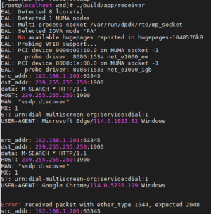

# DPDK学习笔记
author: `zhaodan.wang`

## 1. DPDK简介
from: [dpdk.org](http://dpdk.org/)
> Designed to run on x86, POWER and ARM processors, DPDK is a set of libraries running mostly in Linux userland, with a FreeBSD port available for a subset of features. Licensed under the Open Source BSD License.  
> 
> - Receive and Send Packets Within the Minimum Number of CPU Cycles
> - Develop Fast Packet Capture Algorithms (tcpdump-like)
> - Run Third-Party Fast Path Stacks

即Linux用户态的高性能网络库，主要用于数据包的收发，以及数据包的捕获。DPDK的主要特点是高性能，低延迟，低CPU占用。DPDK的主要应用场景是虚拟化场景，减少从宿主机到虚拟化平台再到虚拟机多次内存拷贝，如NFV，SDN等。 

dpdk 19.11.14手册：[dpdk-19.11](https://doc.dpdk.org/guides-19.11//)


## 2. DPDK的安装
### 2.1 环境准备
采用dpdk19.11.14
- 系统：RedHawk 7.3
- Linux kernel 4.4.60
- gcc 4.8.5
- pkg-config 0.27.1
- python 2.7.5

采用dpdk22.11
- 系统：RedHawk 7.3
- Linux kernel 4.4.60
- gcc 4.8.5
- pkg-config 0.27.1
- Python 3.6.8
- Meson 0.61.5
- ninja 1.11.1
- pyelftools 0.29

### 2.2 ~~安装步骤~~（一般DPDK项目使用）
1. 解压dpdk-19.11.4.tar.xz  
    ```bash
   tar xf dpdk-19.11.14.tar.xz  
   cd dpdk-stable-19.11.14
   ```
    或解压dpdk-22.05.0_2.10.tar.xz
    ```bash
    tar xf dpdk-21.05.0_2.10.tar.gz  
   cd dpdk-21.05.0_2.10
    ```
2. 编译dpdk  
    ```bash
   export RTE_SDK=$PWD
   export RTE_TARGET=x86_64-native-linuxapp-gcc
   export FF_PATH=`pwd`
   export FF_DPDK=$RTE_SDK/x86_64-native-linuxapp-gcc
   make config T=$RTE_TARGET O=$RTE_TARGET
   cd $RTE_TARGET

   make -j 4
   make install
   ```
    或对于dpdk21.05
    ```bash
    meson configue
    meson -Dexamples=all -Denable_kmods=true build
    ninja -C build
    cd build
    meson install
    ldconfig
    ```
    此外，默认install的位置是/usr/local/lib64/，对于编译、链接可能会产生影响，应按照个人习惯进行配置。
3. 挂载UIO模块(napatech网卡不需要)
    ```bash
   modprobe uio
   insmod $RTE_SDK/$RTE_TARGET/kmod/igb_uio.ko
   ```
4. 绑定网卡到UIO模块 (napatech网卡不需要)
五楼实验室网卡参数如下：ens25f1 ens25f2 ens25f3  
0000:ca:00.1等  
   
    ```bash
   ifconfig ens25f1 down
   $RTE_SDK/usertools/dpdk-devbind.py --status
   $RTE_SDK/usertools/dpdk-devbind.py --bind=igb_uio 0000:ca:00.1
    ```
5. 设置大页内存  
    通过没有节点关联的系统分配内存页，应使用`/sys/kernel/mm/hugepages/hugepages-2048kB/nr_hugepages`，指定具体NUMA节点上的大页内存则应该操作`/sys/devices/system/node/nodeN/hugepages/hugepages-2048kB/nr_hugepages`，其中，`N`取值为希望操作的NUMA节点号。  
   ```bash
   echo 2048 > /sys/kernel/mm/hugepages/hugepages-2048kB/nr_hugepages
   mkdir -p /mnt/huge
   mount -t  hugetlbfs  nodev  /mnt/huge
   ```
6. 使用VFIO替代UIO  
   根据Intel的[文档](https://edc.intel.com/content/www/us/en/design/products/ethernet/config-guide-e810-dpdk/loading-the-vfio-pci-module/)，使用VFIO需要用到多数Linux发行版的VFIO模块，但是RedHawk 7.3的内核中没有该模块，因此需要手动编译内核，或者寻求其他解决方案。update 2023.7.27: 重编译内核，勾选VFIO模块，选择新安装的内核启动，即可使用VFIO。  
   另有参考[DPDK官方文档](https://doc.dpdk.org/guides/linux_gsg/linux_drivers.html#vfio)  
   下列指令来自[阿里云](https://help.aliyun.com/document_detail/310880.html)，未经验证：修改grub配置，在cmdline中添加iommu=pt intel_iommu=on，重启系统。
   
   ```bash
   modprobe vfio && \
   modprobe vfio-pci
   $RTE_SDK/usertools/dpdk-devbind.py --status
   $RTE_SDK/usertools/dpdk-devbind.py --bind=vfio-pci 0000:1e:00.0
   ```

### 2.3 使用napatech网卡的DPDK安装

1. 解压`ntanl_package_3gd-12.6.4.1-linux.tar.gz`和`dpdk-19.11.0_2.6.tar.gz`

   ```bash
   tar xvf ntanl_package_3gd-12.6.4.1-linux.tar.gz
   tar xvf dpdk-19.11.0_2.6.tar.gz
   ```

2. 首先编译网卡驱动，其次编译定制版DPDK

   ```bash
   cd ntanl_package_3gd-12.6.4-linux/
   ./package_install_3gd.sh
   export NAPATECH3_PATH=/opt/napatech3
   
   cd ../dpdk-19.11.0_2.6/
   export RTE_SDK=$PWD
   export RTE_TARGET=x86_64-native-linuxapp-gcc
   make config T=$RTE_TARGET O=$RTE_TARGET
   cd $RTE_TARGET
   
   make -j 4
   make install
   ```

   以上环境变量建议配置在`~/.bashrc`文件中，方便后续测试、编译使用。

3. 启动网卡，配置KNI和大页内存

   ```bash
   /opt/napatech3/bin/ntstart.sh
   
   /opt/dpdk-19.11.0_2.6/usertools/dpdk-setup.sh
   ```

## 3. DPDK的简单应用

使用DPDK接管网卡，编写一个简单的UDP收发程序，实现网卡的收发功能。  
核心思路与普通socket编程类似，只是使用DPDK的API来实现；通过打开网卡、设置网卡属性、创建队列、接收数据包、发送数据包等步骤，实现网卡的收发功能。

### 3.1 测试程序结构
接收端：将dpdk绑定的网卡接入交换机，开启网卡混杂模式，监听广播域中的UDP报文。通常为组播或者广播报文。  

  
发送端：由于完整的收发包需要实现诸如arp等协议建立二三层路由转发，本实现选择通过完整虚构二、三、四层报文头部信息，直接把udp报文发送给一个拥有正常内核协议栈的主机。在该主机上运行抓包程序即可捕获由dpdk程序发出的数据包。


### 3.2 程序中使用到的DPDK API
按照此类程序惯用套路，根据调用顺序依次总结api的用法。部分字面意义的宏不予赘述。

1. rte_eal_init  
   初始化dpdl EAL环境抽象层，所有dpdk应用程序的通用模块
2. rte_pktmbuf_pool_create  
   创建内存池，做为收发包的缓存
3. rte_eth_dev_count_avail  
   获取满足uio或vfio驱动的端口数量
4. rte_eth_dev_info_get  
   获取端口在配置为dpdk使用之前的信息
5. rte_eth_dev_socket_id  
   获取端口的socket id供后续api调用使用
6. rte_eth_dev_configure  
   配置端口参数，将准备好的收发队列数和port conf（多为默认值）应用到端口上
7. rte_eth_rx_queue_setup/rte_eth_tx_queue_setup  
   为port设置网卡队列个数，配合多核处理器和多线程提高程序效率。发送队列与接受队列的区别是，发送队列不会自动初始化内存池，如需要使用内存应自行实现。
8. rte_eth_dev_start  
   经过上述api的初始化后，启动端口
9.  rte_eth_promiscuous_enable  
    打开指定端口的混杂模式，即不校验目的mac
10. rte_pktmbuf_alloc  
    在内存池中为报文帧分配内存
11. rte_memcpy  
    对memcpy函数针对dpdk的内存特点进行优化
12. rte_eth_rx_burst/rte_eth_tx_burst  
    核心业务逻辑。将准备好的数据包发送出去/从端口接收数据包
13. rte_pktmbuf_free  
    在内存池中为先前申请的内存做释放处理


## 4. DPDK KNI示例应用
### 4.1 KNI环境准备
要使用KNI，需要在内核中加载rte_kni.ko模块。无参数地加载模块是[DPDK文档](http://doc.dpdk.org/guides-19.11/prog_guide/kernel_nic_interface.html)推荐的典型模式，在生产环境中，考虑到性能和测试问题时则应参考文档传递合适的参数。  
```bash
insmod $RTE_SDK/$RTE_TARGET/kmod/rte_kni.ko
```

### 4.2 KNI应用程序
KNI应用程序的主要功能是将DPDK收到的数据包转发到Linux内核协议栈，或者将Linux内核协议栈收到的数据包转发到DPDK。  
示例kni程序的典型执行如下  
```bash
./kni -l 4-7 -n 2 -- -P -p 0x3 -m --config="(0,4,6,2),(1,5,7,3)"
```
其中，`-l 4-7 -n 4`指定了绑定4-7核，四通道内存，`-P -p 0x3 --config="(0,4,6,8),(1,5,7,9)"`指定了混杂模式、0011的端口掩码（启用端口0、1）、端口0使用468核，端口1使用579核心  

当KNI设备启动后，内核工具即可管理vEth接口。  
```bash
ip addr add dev vEth0_0 192.168.1.201
ip link set dev vEth0_0 lladdr 0C:01:02:03:04:08
ip link set dev vEth0_0 mtu 1450
```
值得注意的是，示例代码仅提供了二层转发的功能，没有对收发的数据包做区分或者修改。对于数据包的具体内容，核心修改部分为程序的第228行kni_ingress函数和269行kni_egress函数。参照基本的receiver和sender程序，可以实现对数据包的修改。    

在实验室主机上测试可得，经过二层转发后网口与普通网口功能并无区别，可以正常收发数据包，且在程序中对收发包情况进行统计。

## 5. flow classify结合kni应用
根据项目需求，不同类型的数据包需要经过不同的处理流程。例如，对于普通的协议包，需要交给kni经由内核处理，对于业务包，需要匹配后交给相关服务。

查阅[文档](https://doc.dpdk.org/guides-19.11/prog_guide/rte_flow.html#actions)可得，分类后的数据包有若干action，其中最为符合需求的是QUEUE动作。从前述学习内容中可知，DPDK程序需要在一个网口上打开若干个收发包队列，而QUEUE动作将符合匹配的数据包从一个队列转移至另外一个队列。因此，对于kni应用程序，空出一个队列用于接收匹配得到的数据包，设置另一线程从指定的队列取出数据包封装成接口交给上层应用即可。

经过仔细阅读文档后，确认classify库无法用于当前项目。根据[文档]([27. Flow Classification Library — Data Plane Development Kit 19.11.14 documentation (dpdk.org)](https://doc.dpdk.org/guides-19.11/prog_guide/flow_classify_lib.html))的第二段部分：

> The initial implementation supports counting of IPv4 5-tuple packets which match a particular Flow rule only.

该库已经停止维护，即将移除dpdk主线，因此高版本也无对该库进行进一步的开发以支持queue动作。

## 6. rte_flow结合kni应用

参照demo flow filter程序，对kni示例进行改进。针对项目使用的`napatech NT40E3_4_PTP`型号网卡，使用专用的DPDK版本以及`NTACC`驱动对代码进行优化。

### 6.1 驱动对项目所需的常见rte_flow Filter Items的支持

| rte_flow filter           | Supported fields                                             |
| ------------------------- | ------------------------------------------------------------ |
| `RTE_FLOW_ITEM_TYPE_END`  |                                                              |
| `RTE_FLOW_ITEM_TYPE_ETH`  | `src.addr_bytes`<br>`dst.addr_bytes`<br>`type`               |
| `RTE_FLOW_ITEM_TYPE_IPV4` | `hdr.version_ihl`<br>`hdr.type_of_service`<br>`hdr.total_length`<br>`hdr.packet_id`<br>`hdr.fragment_offset`<br>`hdr.time_to_live`<br>`hdr.next_proto_id`<br>`hdr.dst_addr`<br>`hdr.src_addr` |
| `RTE_FLOW_ITEM_TYPE_TCP`  | `hdr.src_port`<br>`hdr.dst_port`<br>`hdr.data_off`<br>`hdr.tcp_flags` |
| `RTE_FLOW_ITEM_TYPE_UDP`  | `hdr.src_port`<br>`hdr.dst_port`                             |

本驱动的实现支持对于协议栈底层协议的省略。如，在匹配时使用规则IPv6+UDP即可捕获任何二层封装的ipv6 udp数据包。

### 6.2 驱动对rte_flow Filter Attributes的支持

|            |                                                           |
| ---------- | --------------------------------------------------------- |
| Attribute  | Values                                                    |
| `priority` | 0 – 62<br> Highest priority = 0<br/> Lowest priority = 62 |
| `ingress`  |                                                           |

显然，本实现仅支持对入栈流量进行过滤。

### 6.3 驱动对Filter Priority的支持

对于多个重叠规则，支持使用优先级来决定数据包命中哪个规则。同优先级的规则命中最后输入的规则。

### 6.4 驱动对rte_flow Filter Actions的支持

| Action                                  | Supported fields                                       |
| --------------------------------------- | ------------------------------------------------------ |
| `RTE_FLOW_ACTION_TYPE_END`              |                                                        |
| `RTE_FLOW_ACTION_TYPE_VOID`             |                                                        |
| `RTE_FLOW_ACTION_TYPE_MARK`             | See description below                                  |
| `RTE_FLOW_ACTION_TYPE_RSS`              | `func`<br>`level`<br>`types`<br>`queue_num`<br>`queue` |
| `RTE_FLOW_ACTION_TYPE_QUEUE`            | `index`                                                |
| `RTE_FLOW_ACTION_TYPE_DROP`             |                                                        |
| `RTE_FLOW_ACTION_TYPE_PORT_ID`          | `id`                                                   |
| `RTE_FLOW_ACTION_TYPE_REPRESENTED_PORT` | `port_id`                                              |

MARK、RSS、DROP动作的解释略。由文档易得，本网卡不支持对Filter进行分组操作。

- `RTE_FLOW_ACTION_TYPE_PORT_ID` 将数据包重发至DPDK程序绑定的另一端口上。
- `RTE_FLOW_ACTION_TYPE_REPRESENTED_PORT` 与上述方法类似，但是端口号由物理网卡的端口号标识。对于本例，取值为0-3。

### 6.5 多条五元组规则的应用

对于单条五元组规则，`pattern[0]`取值IPv4，`pattern[1]`取值TCP，设定action后即可调用`rte_flow_create()`提交。在调用`rte_flow_create()`提交前，所有pattern数组中的规则在过滤时为“与”逻辑，即同时满足pattern数组内全部条件的数据包才能够命中该条规则。

如果希望应用多条不同优先级的规则，并使用“或”逻辑时，应循环多次调用`rte_flow_create()`提交规则。每条规则的pattern数组应独立编写，并均从下标0开始赋值。

根据文档介绍，驱动支持多达20000条五元组规则。具体条目数视规则的复杂程度决定，调用`rte_flow_validate()`可检查是否可继续添加。

### 6.6 kni程序使用Flow Filter

经过程序测试，在kni模块处理来自内核的操作时会周期性的调用`rte_kni_handle_request`函数，该函数会触发`kni_alloc`函数中绑定的若干回调函数。其中设置内核虚拟网卡开关的回调函数`config_network_if`，原demo对于开网卡的逻辑是先关再开，而flow filter的规则是跟随网卡而设定的，因此在关闭后即失效。因此，需要重写该回调函数，在每次开关网卡时重新应用过滤规则。

 ### 6.7 针对环境中的包分片情况使用IP Fragmentation and Reassembly库

对于默认的以太网环境，三层数据包最大长度为1500。数据包的分片在高速传输过程中会导致严重的性能损失：接收方需要针对数据包进行多次拷贝，使用哈希表以匹配分片包。在万兆的网络中，使用巨型帧规避分片提高程序效率和带宽利用率是更为明智的选择。


## 7. DPDK性能测试

写在性能测试前：

- 关于DPDK的包分类(flow filter，rte_flow api)，提供了一个Flow isolated mode，功能很符合项目要求
- 多线程优化
- 受限于发包性能，每包包长会严重影响到整体的链路速率。考虑到10G光口的存在，应按需调整收发两端的MTU值，即应用巨型帧发送数据包，在减少IP层分片情况的同时优化线路的利用率。

### 7.1 dpdk pktgen的使用

pktgen程序依赖于dpdk，选择pktgen19.12。同时依赖与libpcap lua，通过源码编译安装即可。该工具不支持ntacc驱动下的网卡。

基本使用：-m 17.0代表0号端口使用17号核心

```bash
./pktgen -l 16-17 -n 4 -- -m 17.0
```

常用内部[命令行]([Pktgen command line directory format — Pktgen 23.06.1 documentation (pktgen-dpdk.readthedocs.io)](https://pktgen-dpdk.readthedocs.io/en/latest/commands.html#runtime-options-and-commands))功能如下：

```bash
set <portlist> count <value>       - number of packets to transmit
set <portlist> size <value>        - size of the packet to transmit
set <portlist> rate <percent>      - Packet rate in percentage
set <portlist> sport <value>       - Source port number for TCP
set <portlist> dport <value>       - Destination port number for TCP
set <portlist> ttl <value>         - Set the TTL value for the single port more
set <portlist> type ipv4|ipv6|vlan|arp - Set the packet type to IPv4 or IPv6 or VLAN
set <portlist> proto udp|tcp|icmp  - Set the packet protocol to UDP or TCP or ICMP per port
set <portlist> [src|dst] ip ipaddr - Set IP addresses, Source must include network mask e.g. 10.1.2.3/24


start <portlist>                   - Start transmitting packets
stop <portlist>                    - Stop transmitting packets
stp                                - Stop all ports from transmitting
str                                - Start all ports transmitting
```

生成数据包测试：

```bash
range 0 dst mac start 01:00:5e:7f:00:01
range 0 dst ip 239.255.0.1 239.255.0.1 239.255.0.2 0.0.0.1
range 0 proto udp
range 0 size 64 64 1518 1
enable 0 range
```

单包测试结果：


### 7.2 基于iperf3的内核性能基准测试

测试环境：两台使用napatech的网卡运行kni程序，使用光纤直连。

3G tcp包：


6G udp包：


## 8. 组播环境测试

根据现有讨论，组播数据包应由三层交换机或路由器进行管理，通过IGMP报文控制组播包的流向。

经过测试，在开启IGMP Snooping功能的交换机上才可以实现真正的组播控制，即交换机只向报告加入某组的设备推送组播报文，而不是以广播的形式发送组播数据包。